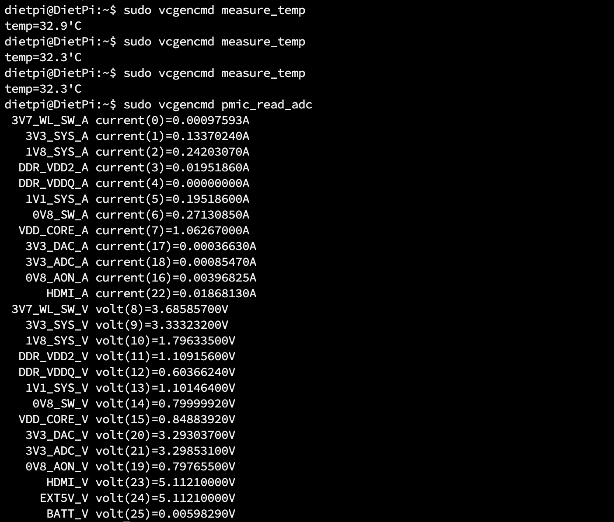
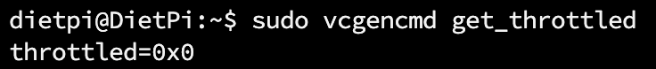
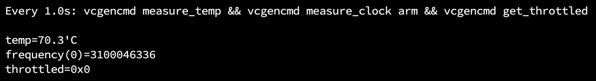
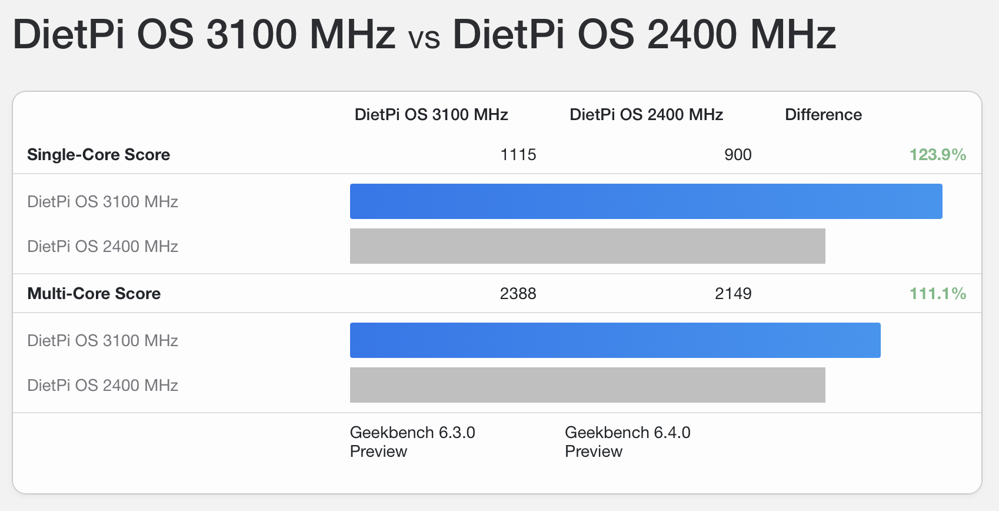

# The Complete Raspberry Pi 5 Overclocking Guide

*Unlock the full potential of your Raspberry Pi 5 with safe, methodical overclocking*

---

## Disclaimer

**IMPORTANT: Read before proceeding**

Overclocking your Raspberry Pi 5 is done entirely **at your own risk**. This process may:

- Void your warranty
- Cause permanent hardware damage
- Lead to system instability, data corruption, or data loss
- Reduce the lifespan of your device

The author is not responsible for any damage resulting from following this guide. **Raspberry Pi** is a trademark of Raspberry Pi Ltd. The author is not affiliated with Raspberry Pi Ltd and uses this name purely for descriptive purposes.

**Active cooling is MANDATORY for overclocking.** Do not attempt to overclock with passive cooling or no cooling solution.

---

## Table of Contents

1. [Introduction](#introduction)
2. [Prerequisites](#prerequisites)
3. [Understanding Silicon Revisions (D0 vs C1)](#understanding-silicon-revisions-d0-vs-c1)
4. [Default Values and Parameters](#default-values-and-parameters)
5. [Editing config.txt](#editing-configtxt)
6. [Firmware Update Procedures](#firmware-update-procedures)
7. [Step-by-Step Overclocking Procedure](#step-by-step-overclocking-procedure)
8. [Stability Testing with Pi-Under-Pressure](#stability-testing-with-pi-under-pressure)
9. [CPU Governor Settings](#cpu-governor-settings)
10. [Monitoring and Diagnostics](#monitoring-and-diagnostics)
11. [Fan Speed Configuration](#fan-speed-configuration)
12. [PCIe Gen 3 Mode](#pcie-gen-3-mode)
13. [Understanding Throttling](#understanding-throttling)
14. [Recovery When System Won't Boot](#recovery-when-system-wont-boot)
15. [Performance Benchmarking](#performance-benchmarking)
16. [OS Performance Differences](#os-performance-differences)
17. [Achievable Results and Silicon Lottery](#achievable-results-and-silicon-lottery)
18. [Best Practices Summary](#best-practices-summary)
19. [Advanced: Beyond 3.0 GHz](#advanced-beyond-30-ghz)
20. [FAQ and Troubleshooting](#faq-and-troubleshooting)
21. [Reference Links](#reference-links)

---

## Introduction

The Raspberry Pi 5, powered by the BCM2712 SoC with four Cortex-A76 cores, delivers impressive performance at its stock 2.4 GHz frequency. However, with proper cooling and configuration, many units can achieve stable operation at 2.8-3.0 GHz, unlocking significant additional performance for demanding workloads.

This guide provides a comprehensive, methodical approach to overclocking your Raspberry Pi 5 safely. We'll cover everything from basic configuration to advanced monitoring, with a focus on **verifying stability** using [Pi-Under-Pressure](https://github.com/cmd0s/Pi-Under-Pressure) — a specialized stress-testing tool designed specifically for overclocked Raspberry Pi systems.

**What you'll learn:**
- How to configure overclocking parameters
- How to test stability at each frequency step
- How to monitor your system during stress tests
- How to recover if something goes wrong
- Best practices for long-term stable operation

---

## Prerequisites

Before you begin overclocking, ensure you have:

### Hardware Requirements

| Component | Requirement |
|-----------|-------------|
| **Raspberry Pi 5** | 2GB, 4GB, 8GB, or 16GB model (all work) |
| **Cooling** | Active cooling solution (Official Active Cooler minimum) |
| **Power Supply** | Official 27W USB-C power supply (5.1V / 5A) |
| **Storage** | microSD card or NVMe SSD |
| **Monitor** | HDMI display (recommended for seeing kernel panics) |

### Software Requirements

- 64-bit Raspberry Pi OS or compatible distribution (DietPi, Ubuntu)
- Updated system packages
- Terminal access (SSH or direct)

### Before You Start

1. **Backup your data** — Overclocking can cause system instability
2. **Update your system** — Run `sudo apt update && sudo apt full-upgrade -y`
3. **Note your current settings** — Document stock performance for comparison

---

## Understanding Silicon Revisions (D0 vs C1)

Not all Raspberry Pi 5 units are identical. The BCM2712 SoC has been manufactured with different silicon steppings:

### Stepping Versions

| Stepping | Chip ID | Models | Board Revision |
|----------|---------|--------|----------------|
| **C1** | BCM2712C1 | Original 4GB, 8GB | rev 1.0 |
| **D0** | BCM2712D0 | 2GB, 16GB, later 4GB/8GB | rev 1.1 |

### D0 Stepping Improvements

The D0 stepping features significant improvements:

- **33% smaller die** (37.67mm² vs 55.84mm²)
- **~30% lower idle power** consumption (2.4W vs 3.3W)
- **~4°C cooler** under load
- Removed unused "dark silicon" (Ethernet controller, UARTs 3-4, SDIO0)

**Important:** Despite these thermal advantages, D0 stepping does **not** provide higher maximum overclocking frequencies. The silicon lottery still determines your chip's maximum stable frequency.

**Practical implication:** If you have a 16GB or 2GB model (or newer 4GB/8GB), you may see slightly lower temperatures during stress testing, but your maximum stable frequency will still depend on your specific chip.

*Source: [Jeff Geerling — New 2GB Pi 5 has 33% smaller die, 30% idle power savings](https://www.jeffgeerling.com/blog/2024/new-2gb-pi-5-has-33-smaller-die-30-idle-power-savings)*

---

## Default Values and Parameters

**Note:** These values may vary slightly depending on the operating system, firmware version, and board revision. Always verify your current settings before making changes.

### Stock Configuration

| Parameter | Default Value | Description |
|-----------|---------------|-------------|
| `arm_freq` | 2400 MHz | CPU frequency |
| `gpu_freq` | 910 MHz | VideoCore VII frequency |
| `over_voltage` | 0 | Voltage offset (legacy) |
| `over_voltage_delta` | 0 | Voltage offset in microvolts (recommended) |
| `force_turbo` | 0 | DVFS enabled (default) |

### Overclocking Parameters

| Parameter | Range | Description |
|-----------|-------|-------------|
| `arm_freq` | 2400-3000+ MHz | CPU clock frequency |
| `gpu_freq` | 910-1100 MHz | GPU clock frequency |
| `over_voltage_delta` | 0-50000+ µV | Voltage adjustment (preserves DVFS) |
| `over_voltage` | 0-8 | Legacy voltage offset (disables DVFS) |
| `force_turbo` | 0 or 1 | Force maximum frequency always |

> **Tip: Start with CPU only**
>
> When beginning your overclocking journey, focus on `arm_freq` first and leave `gpu_freq` at default (910 MHz). This makes troubleshooting easier — if you change both simultaneously and experience instability, you won't know which one is causing the problem. Only increase `gpu_freq` after you've found a stable CPU frequency, and only if you have a specific use case (desktop graphics, V3D, video encoding).

### Why Use over_voltage_delta Instead of over_voltage?

The `over_voltage_delta` parameter is **strongly recommended** over the legacy `over_voltage` because:

1. **Preserves DVFS** — Dynamic Voltage and Frequency Scaling continues to work
2. **Better power efficiency** — System can still downclock when idle
3. **Finer control** — Adjustments in microvolts instead of fixed steps
4. **Lower idle temperatures** — Voltage scales with frequency

### over_voltage_delta Value Guide

The value is specified in **microvolts (µV)**. The maximum effective voltage is **capped at 1.0V** by hardware, regardless of settings.

| Value (µV) | Voltage Added | Risk Level | Typical Use Case |
|------------|---------------|------------|------------------|
| 0 | +0.000V | Safe | Stock operation |
| 10000 | +0.010V | Safe | Mild OC (2.5-2.6 GHz) |
| 25000 | +0.025V | Safe | Conservative OC (2.7-2.8 GHz) |
| 50000 | +0.050V | Moderate | Common stable OC (2.8-3.0 GHz) |
| 75000 | +0.075V | Higher | Pushing limits (3.0 GHz) |
| 100000+ | +0.100V+ | High | Extreme OC (not recommended) |

**Recommendations:**

- **Start low** — Begin with `over_voltage_delta=0` and only increase if stability tests fail
- **Safe zone** — Values up to 50000 µV are generally considered safe for daily use
- **Caution zone** — Values 50000-75000 µV require excellent cooling
- **Danger zone** — Values above 75000 µV significantly increase heat and may reduce chip lifespan
- **Hardware limit** — The BCM2712 has a hard cap at 1.0V; higher delta values won't exceed this

**Undervolting:** The value is a signed integer, so negative values (e.g., `-5000`) can be used for undervolting to reduce power consumption and heat.

*Sources: [Raspberry Pi Forums](https://forums.raspberrypi.com/viewtopic.php?t=362296), [Jeff Geerling](https://www.jeffgeerling.com/blog/2023/overclocking-and-underclocking-raspberry-pi-5)*

### What Does force_turbo=1 Do?

By default (`force_turbo=0`), the CPU frequency governor dynamically adjusts clock speeds:
- **Under load** — Clocks increase to maximum frequency
- **At idle** — Clocks drop to minimum frequency to save power

Setting `force_turbo=1`:
- **Forces maximum frequency at all times**, even when idle
- **Increases power consumption** and heat during idle
- **Disables frequency scaling** part of DVFS (voltage scaling may still work)

**When to use:**
- Benchmarking (ensures consistent maximum performance)
- Latency-sensitive applications
- When you want to eliminate frequency ramping delays

**When NOT to use:**
- Daily operation (unnecessary power consumption)
- 24/7 running systems (extra heat, wear)

**Important:** Raspberry Pi officially discourages using `force_turbo=1` for normal overclocking. It's primarily a benchmarking tool. For daily use, rely on the CPU governor to manage frequencies dynamically.

---

## Editing config.txt

### File Location

On Raspberry Pi OS (Trixie, Bookworm, and newer), the configuration file is located at:

```
/boot/firmware/config.txt
```

**Note:** Older guides may reference `/boot/config.txt`. On modern Raspberry Pi OS, a symlink exists for backwards compatibility, but always use `/boot/firmware/config.txt` to avoid issues.

### How to Edit

```bash
sudo nano /boot/firmware/config.txt
```

**Saving and applying changes:**

1. Press `Ctrl+X` to exit nano
2. When prompted "Save modified buffer?", press `Y` to confirm
3. Press `Enter` to confirm the filename
4. **Reboot is required** for changes to take effect:
   ```bash
   sudo reboot
   ```

Changes to `config.txt` are only applied during boot. The system reads this file before the Linux kernel starts, so there is no way to apply changes without rebooting.

### Example Overclock Configuration

Add these lines under the `[pi5]` section (create it if it doesn't exist):

```ini
[pi5]
# Overclocking settings
arm_freq=2800
gpu_freq=1000
over_voltage_delta=50000

# Optional: Force turbo
# force_turbo=1
```

### Safe Starting Point

For initial testing, start with a conservative overclock:

```ini
[pi5]
arm_freq=2600
over_voltage_delta=10000
```

*For complete documentation, see: [Raspberry Pi config.txt Documentation](https://www.raspberrypi.com/documentation/computers/config_txt.html)*

---

## Firmware Update Procedures

Keeping your firmware updated is important for stability and compatibility with overclocking.

### Standard Method (apt)

This installs stable, tested firmware versions:

```bash
sudo apt update && sudo apt full-upgrade -y
sudo rpi-eeprom-update
```

To apply a pending update:

```bash
sudo rpi-eeprom-update -a
sudo reboot
```

### Advanced Method (rpi-eeprom from GitHub) — Recommended for OC

For the latest bleeding-edge EEPROM firmware, use the official rpi-eeprom repository:

```bash
git clone https://github.com/raspberrypi/rpi-eeprom.git
cd rpi-eeprom
sudo ./test/install       # Install latest firmware
```

For beta/bleeding-edge firmware:

```bash
sudo ./test/install -b    # Install beta firmware
```

**What this does:**
- Copies firmware to `/lib/firmware/raspberrypi/bootloader`
- Installs `rpi-eeprom-config`, `rpi-eeprom-digest`, `rpi-eeprom-update` to `/usr/bin`
- Updates configuration at `/etc/default/rpi-eeprom-update`

**After installation, apply the update:**

```bash
sudo rpi-eeprom-update -a
sudo reboot
```

**Verify the update:**

```bash
sudo rpi-eeprom-update
```

*Source: [GitHub — raspberrypi/rpi-eeprom](https://github.com/raspberrypi/rpi-eeprom)*

---

## Step-by-Step Overclocking Procedure

Follow this methodical approach to find your maximum stable frequency:

### The Process

```
┌─────────────────────────────────────────────────────────────┐
│  1. Start at stock (2400 MHz)                               │
│                    ↓                                        │
│  2. Increase arm_freq by 50 MHz                             │
│                    ↓                                        │
│  3. Reboot                                                  │
│                    ↓                                        │
│  4. Run Pi-Under-Pressure for 3 minutes                     │
│                    ↓                                        │
│  ┌──────────────────────────────────────────────────────┐  │
│  │ PASSED (green)?                                       │  │
│  │   YES → Go to step 2, increase by another 50 MHz     │  │
│  │   NO  → Add over_voltage_delta (+10000 µV)           │  │
│  │         Retest. If still fails, reduce arm_freq      │  │
│  └──────────────────────────────────────────────────────┘  │
│                    ↓                                        │
│  5. When stable at target frequency, run extended test (1h+)│
│                    ↓                                        │
│  6. If extended test passes → OC successful!                │
└─────────────────────────────────────────────────────────────┘
```

### Example Progression

| Step | arm_freq | over_voltage_delta | Result |
|------|----------|-------------------|--------|
| 1 | 2400 MHz | 0 | Baseline (stock) |
| 2 | 2450 MHz | 0 | PASSED |
| 3 | 2500 MHz | 0 | PASSED |
| 4 | 2550 MHz | 0 | PASSED |
| 5 | 2600 MHz | 0 | PASSED |
| 6 | 2650 MHz | 0 | PASSED |
| 7 | 2700 MHz | 0 | FAILED (errors) |
| 8 | 2700 MHz | 10000 | PASSED |
| 9 | 2750 MHz | 10000 | PASSED |
| 10 | 2800 MHz | 10000 | FAILED |
| 11 | 2800 MHz | 20000 | PASSED |
| 12 | 2800 MHz | 20000 | **1h test → PASSED** ✓ |

**Final stable configuration:** `arm_freq=2800`, `over_voltage_delta=20000`

> **Tip: Speed up the process**
>
> You don't have to start from stock 2400 MHz. The vast majority of Raspberry Pi 5 units will boot and run stable at **2600-2700 MHz** without any voltage adjustment. To save time:
>
> 1. Start directly at `arm_freq=2600` (or even `2700`)
> 2. If it boots and passes a quick 3-minute test, continue increasing
> 3. If it fails to boot or crashes, step back to 2500 MHz and work your way up
>
> This approach can save you 10-15 iterations in the tuning process.

---

## Stability Testing with Pi-Under-Pressure

**Pi-Under-Pressure** is a specialized stability testing tool designed specifically for overclocked Raspberry Pi 5 systems. It simultaneously stresses CPU, RAM, and optionally NVMe storage while monitoring for errors, throttling, and thermal issues.

### Why [Pi-Under-Pressure](https://github.com/cmd0s/Pi-Under-Pressure)?

- **Multi-component stress testing** — Tests CPU, RAM, and NVMe simultaneously
- **Real-time monitoring** — Temperature, throttling, frequency, and errors
- **I/O error detection** — Monitors kernel logs for I/O errors and hardware issues (with `-e` flag)
- **Designed for Pi 5** — Optimized for ARM Cortex-A76 architecture
- **Clear pass/fail results** — Green = stable, Red = unstable

### Installation

```bash
curl -sSL https://raw.githubusercontent.com/cmd0s/Pi-Under-Pressure/main/install.sh | bash
```

### Usage

**Quick stability check (3 minutes):**

```bash
sudo pi-under-pressure -d 3m
```

**Extended stability test (1 hour):**

```bash
sudo pi-under-pressure -d 1h
```

**Full test with NVMe stress:**

```bash
sudo pi-under-pressure -d 1h -e
```

**With video encoder stress (requires ffmpeg):**

```bash
sudo pi-under-pressure -d 1h -V
```

### What It Tests

| Component | Workloads |
|-----------|-----------|
| **CPU** | FFT, Matrix Multiplication, Prime Sieve, AES-256 Encryption |
| **RAM** | Sequential patterns, Random access, Fill & verify, STREAM-like bandwidth |
| **NVMe** | 4K random I/O, Sequential read/write, Mixed workload |
| **Video** | H.264/H.265 hardware encoding (optional) |

### Understanding Results

**A test is successful ONLY if:**

1. ✅ The test runs to **completion** (no crashes, freezes, or kernel panics)
2. ✅ The final report displays in **GREEN** showing **PASSED**
3. ✅ **Zero errors** in all categories (CPU, RAM, NVMe, throttling)

**If ANY of these conditions are not met, your overclock is NOT stable.**


### Testing Strategy

| Phase | Duration | Purpose |
|-------|----------|---------|
| **Quick check** | 3 minutes | Fast validation after each frequency change |
| **Confirmation** | 15-30 minutes | Verify stability before moving to next step |
| **Final validation** | 1+ hours | Confirm long-term stability |
| **Burn-in** | 8+ hours | Maximum confidence (optional) |

**Time-saving tip:** Start with 3-minute tests. Only run extended tests once you've found a frequency that passes the quick check. This saves significant time during the iterative tuning process.

*Source: [Pi-Under-Pressure on GitHub](https://github.com/cmd0s/Pi-Under-Pressure)*

---

## CPU Governor Settings

The CPU governor controls how the processor scales its frequency based on load.

### Available Governors

| Governor | Description |
|----------|-------------|
| `ondemand` | Default on Pi OS. Scales frequency based on CPU load |
| `schedutil` | More responsive, uses scheduler data |
| `performance` | Maximum frequency always. Best for benchmarks |
| `powersave` | Minimum frequency always. Maximum efficiency |

### Check Current Governor

```bash
cat /sys/devices/system/cpu/cpufreq/policy0/scaling_governor
```

### Temporary Change (resets on reboot)

```bash
echo performance | sudo tee /sys/devices/system/cpu/cpufreq/policy0/scaling_governor
```

Verify the change:

```bash
cat /sys/devices/system/cpu/cpufreq/policy0/scaling_governor
```

### Permanent Change (using cpufrequtils)

Install cpufrequtils:

```bash
sudo apt install cpufrequtils
```

Edit the configuration file:

```bash
sudo nano /etc/default/cpufrequtils
```

Add the following line:

```
GOVERNOR="performance"
```

Save the file, then enable and start the service:

```bash
sudo systemctl enable cpufrequtils
sudo systemctl restart cpufrequtils
```

After reboot, verify the setting persists:

```bash
cat /sys/devices/system/cpu/cpufreq/policy0/scaling_governor
```

### Recommendation for Overclocking

Use `schedutil` for daily use — it's more responsive than `ondemand` and still allows power saving when idle. Use `performance` only during benchmarking or stress testing.

---

## Monitoring and Diagnostics

### Essential Commands

**Check CPU temperature:**

```bash
sudo vcgencmd measure_temp
```

**Check current CPU frequency:**

```bash
sudo vcgencmd measure_clock arm
```

**Check GPU frequency:**

```bash
sudo vcgencmd measure_clock core
```

**Check voltage:**

```bash
sudo vcgencmd pmic_read_adc
```

Look for `EXT5V_V` — this shows the actual voltage your Pi is receiving.

### Throttling Status

```bash
sudo vcgencmd get_throttled
```

This returns a hexadecimal value representing the current and historical throttling status.



### Throttle Flag Meanings

| Bit | Hex Mask | Current State | Meaning |
|-----|----------|--------------|---------|
| 0 | 0x1 | Under-voltage detected | Power supply issue |
| 1 | 0x2 | Arm frequency capped | Frequency limited |
| 2 | 0x4 | Currently throttled | Active thermal throttling |
| 3 | 0x8 | Soft temperature limit | Approaching thermal limit |

| Bit | Hex Mask | Historical (Since Boot) | Meaning |
|-----|----------|-------------------------|---------|
| 16 | 0x10000 | Under-voltage has occurred | Power issue since boot |
| 17 | 0x20000 | Arm frequency capping occurred | Was limited since boot |
| 18 | 0x40000 | Throttling has occurred | Was throttled since boot |
| 19 | 0x80000 | Soft temperature limit occurred | Hit limit since boot |

**Important:** Historical bits (16-19) are "sticky" — they remain set until you reboot. If you see `0x50000` but no current issues (bits 0-3 are clear), it means the problem occurred earlier but has since resolved. A reboot will clear the historical bits.

### Common Values

| Value | Meaning |
|-------|---------|
| `0x0` | **Perfect** — No issues ever |
| `0x50000` | Under-voltage and throttling occurred at some point |
| `0x50005` | Currently under-voltage AND throttled |

**For a successful overclock, you want `0x0` after a stress test.**



### Continuous Monitoring

```bash
sudo watch -n 1 'vcgencmd measure_temp && vcgencmd measure_clock arm && vcgencmd get_throttled'
```



---

## Fan Speed Configuration

### Typical Fan Behavior

The official Active Cooler uses PWM control. These are **typical values** — actual defaults may vary depending on firmware version and cooling solution:

| Temperature | Fan Speed |
|-------------|-----------|
| Below 50°C | Off |
| 50°C | 30% (speed 75) |
| 60°C | 50% (speed 125) |
| 67.5°C | 70% (speed 175) |
| 75°C | 100% (speed 250) |

**Recommendation:** For overclocking, always configure your own fan curve to ensure adequate cooling rather than relying on defaults.

### Custom Fan Configuration

Add these parameters to `/boot/firmware/config.txt`:

```ini
# More aggressive cooling for overclocking
dtparam=fan_temp0=45000
dtparam=fan_temp0_hyst=5000
dtparam=fan_temp0_speed=100

dtparam=fan_temp1=55000
dtparam=fan_temp1_hyst=5000
dtparam=fan_temp1_speed=150

dtparam=fan_temp2=65000
dtparam=fan_temp2_hyst=5000
dtparam=fan_temp2_speed=200

dtparam=fan_temp3=70000
dtparam=fan_temp3_hyst=5000
dtparam=fan_temp3_speed=255
```

**Parameters explained:**
- `fan_tempX` — Temperature threshold in millidegrees (45000 = 45°C)
- `fan_tempX_hyst` — Hysteresis to prevent rapid on/off cycling
- `fan_tempX_speed` — PWM value 0-255 (255 = maximum)

---

## PCIe Gen 3 Mode

The Raspberry Pi 5 features a single PCIe lane that officially operates at **PCIe Generation 2** speeds. However, forcing PCIe Gen 3 mode is a simple configuration change that **doubles the bandwidth** — a form of overclocking that's particularly beneficial for NVMe storage users.

### Default vs Overclocked PCIe

| Mode | Speed | Bandwidth | Status |
|------|-------|-----------|--------|
| **Gen 2** (default) | 5 GT/s | ~500 MB/s | Officially supported |
| **Gen 3** (forced) | 8 GT/s | ~1000 MB/s | Unofficially supported |

### Why Force Gen 3?

While PCIe Gen 3 is not officially supported by Raspberry Pi, in practice:

- **It works very well** — Almost all NVMe adapters and drives handle Gen 3 speeds correctly
- **Double the throughput** — Significant improvement for NVMe SSD performance
- **No stability issues** — From extensive testing, Gen 3 mode is reliable for daily use
- **Easy to enable** — Simple config.txt change, easy to revert if needed

### Configuration

Add the following lines to `/boot/firmware/config.txt` under the `[pi5]` or `[all]` section:

```ini
[pi5]
# Enable PCIe
dtparam=pciex1

# Enable PCIe Gen 3 (default is Gen 2)
dtparam=pciex1_gen=3
```

**After adding these lines, reboot for changes to take effect.**

### Verification

After rebooting, verify the PCIe link speed:

```bash
sudo lspci -vv | grep -i "lnksta:"
```

Look for `Speed 8GT/s` to confirm Gen 3 mode is active.

### When to Use This

- **NVMe SSD users** — If you're booting from or using NVMe storage, Gen 3 provides a noticeable performance improvement
- **High-bandwidth peripherals** — Any PCIe device that can benefit from increased bandwidth

### Compatibility Notes

- **Most adapters work** — The vast majority of NVMe HATs and adapters support Gen 3 speeds without issues
- **Some older devices may not work** — If you experience instability, remove the `pciex1_gen=3` line to revert to Gen 2
- **Official Pi HAT+** — The official Raspberry Pi M.2 HAT+ works reliably with Gen 3 enabled

---

## Understanding Throttling

Throttling is your Pi's protection mechanism against overheating or power issues.

### Types of Throttling

| Type | Trigger | Behavior |
|------|---------|----------|
| **Thermal throttling** | CPU > 80°C | Reduces frequency to lower temperature |
| **Hard thermal limit** | CPU > 85°C | Aggressive frequency reduction, overclock/overvoltage may be disabled |
| **Under-voltage** | Voltage < 4.63V | Caps frequency to reduce power draw |

**Note about `temp_limit`:** The `config.txt` parameter `temp_limit` (default 85) sets the hard thermal limit. This is the point where aggressive throttling kicks in. The soft throttling starts earlier around 80°C.

### Why Throttling = Failed Overclock

If your system throttles during a stability test, your overclock is **not stable**. The system is protecting itself by reducing performance, which means:

1. You won't get the performance you're targeting
2. The system is operating at its limits
3. Long-term reliability may be compromised

**Solution:** Either reduce `arm_freq` or increase `over_voltage_delta` until throttling no longer occurs.

## Recovery When System Won't Boot

If your Pi won't boot after applying overclock settings, don't panic.

### Method 1: Edit config.txt on Another Computer (Recommended)

1. Power off the Pi
2. Remove the microSD card
3. Insert it into another computer (Windows, Mac, or Linux)
4. Open the `bootfs` partition
5. Edit `config.txt` (in `/boot/firmware/` or root of boot partition)
6. Comment out or remove your overclock settings:

```ini
[pi5]
# arm_freq=3000        # Commented out
# over_voltage_delta=50000
```

7. Save, eject, reinsert into Pi, and boot

### Method 2: Hold Shift During Boot (Less Reliable)

Holding the Shift key during boot can temporarily disable overclock settings on some configurations.

**Note:** This method is less reliable on Pi 5 — it depends on boot flow, firmware version, keyboard type, and HDMI connection. If it doesn't work for you, use Method 1 (editing config.txt from another computer).

### Kernel Panic Visibility

If you have an HDMI monitor connected, kernel panics will be visible on screen. This can help diagnose whether the issue is an overclock-related crash or something else.

## Performance Benchmarking

### GeekBench 6 (Primary Benchmark)

GeekBench 6 is the standard benchmark for comparing Raspberry Pi 5 performance.

**Installation:**

```bash
wget https://cdn.geekbench.com/Geekbench-6.4.0-LinuxARMPreview.tar.gz
tar -xzf Geekbench-6.4.0-LinuxARMPreview.tar.gz
cd Geekbench-6.4.0-LinuxARMPreview
```

**Run the benchmark:**

```bash
./geekbench6
```

### GeekBench 6 Scores


[Screenshot: GeekBench 6 results comparing stock 2.4 GHz vs overclocked 3.1 GHz with DietPi OS]

### Current GeekBench 6 Records (as of December 18, 2025)

The highest Raspberry Pi 5 scores we've been able to locate:

| Record | SC Score | MC Score | Frequency | Model | Link |
|--------|----------|----------|-----------|-------|------|
| **Best Single-Core** | **1195** | 2481 | 3.40 GHz | Pi 5 Rev 1.1 (16GB) | [#9905864](https://browser.geekbench.com/v6/cpu/9905864) |
| **Best Multi-Core** | 1180 | **2529** | 3.30 GHz | Pi 5 Rev 1.0 (8GB) | [#9922491](https://browser.geekbench.com/v6/cpu/9922491) |

**Note:** These are extreme overclocking results requiring specialized cooling and are not representative of typical safe overclocking.

### Other Benchmarks

**sysbench (CPU):**

```bash
sudo apt install sysbench
sysbench cpu --threads=4 run
```

**stress-ng:**

```bash
sudo apt install stress-ng
stress-ng --cpu 4 --timeout 60s --metrics-brief
```

**7-Zip compression benchmark:**

```bash
sudo apt install p7zip-full
7z b
```

---

## OS Performance Differences

Your choice of operating system significantly impacts benchmark results.

### Performance Comparison

| Operating System | Performance | Notes |
|-----------------|-------------|-------|
| **Raspberry Pi OS Lite** | Excellent | Minimal overhead, optimized for Pi |
| **DietPi** | Excellent | Highly optimized, minimal footprint |
| **Raspberry Pi OS Desktop** | Very Good | More overhead from desktop environment |
| **Ubuntu Server** | Moderate | More generic, less Pi-optimized |
| **Ubuntu Desktop** | Lower | Significant desktop overhead |

### Recommendation

For maximum overclocking performance and best benchmark scores, use:

1. **Raspberry Pi OS Lite** — Official, optimized, minimal
2. **DietPi** — Community favorite, extremely lean

Both provide noticeably better results than Ubuntu or other general-purpose distributions.

---

## Achievable Results and Silicon Lottery

Every BCM2712 chip is unique. Due to manufacturing variations, some chips can achieve higher stable frequencies than others.

### Typical Results

| Category | Frequency Range | Percentage of Chips |
|----------|-----------------|---------------------|
| **Average** | 2.6-2.8 GHz | Most chips |
| **Good** | 2.9-3.0 GHz | Many chips |
| **Excellent** | 3.0-3.1 GHz | Some chips |
| **Exceptional** | 3.1-3.2+ GHz | Rare |

### Important Notes

1. **Firmware limits:** Older firmware capped at 3.0 GHz. Newer firmware allows higher, but >3.0 GHz remains "extreme" territory.
2. **Silicon lottery:** Your chip's maximum is predetermined — no amount of cooling or voltage will change it significantly.
3. **8GB model consideration:** Reportedly, some 8GB models with Micron RAM may show reduced performance when overclocked due to SDRAM behavior differences. **Update your firmware/EEPROM first** — many SDRAM timing issues have been addressed in recent updates.

*Sources: [GitHub — raspberrypi/firmware Issue #1854](https://github.com/raspberrypi/firmware/issues/1854), [Jeff Geerling — Raspberry Pi boosts Pi 5 performance with SDRAM tuning](https://www.jeffgeerling.com/blog/2024/raspberry-pi-boosts-pi-5-performance-sdram-tuning)*

### Setting Realistic Expectations

- **2.6 GHz:** Almost all chips can achieve this
- **2.8 GHz:** Most chips with adequate cooling
- **3.0 GHz:** Many chips, but not guaranteed
- **3.0+ GHz:** Requires silicon lottery win and excellent cooling

---

## Best Practices Summary

1. **Always use active cooling** — Passive cooling is insufficient for overclocking
2. **Use the official 27W power supply** — Under-voltage causes instability and throttling
3. **Increment frequency in small steps** — 50 MHz per iteration
4. **Test stability at each step** — Use Pi-Under-Pressure
5. **Quick tests first (3m)** — Save time during initial tuning
6. **Extended tests for final validation (1h+)** — Confirm long-term stability
7. **Monitor throttling** — Any throttling = unstable overclock
8. **Keep temperatures below 80°C** — Ideally below 75°C under load
9. **Green report = stable** — Only a green PASSED report means success
10. **Document your settings** — Keep track of what works

---

## Advanced: Beyond 3.0 GHz

Older Raspberry Pi firmware had a hard limit at 3.0 GHz. Newer firmware versions have relaxed this limit, allowing higher frequencies without custom patches. However, achieving frequencies above 3.0 GHz remains an "extreme" scenario:

- **3.14 GHz** — Achieved by Jeff Geerling
- **3.5 GHz** — Achieved by Martin Rowan with dual Peltier cooling

**Important warnings:**

- Risk of **permanent hardware damage** is significantly higher
- Requires **extreme cooling solutions** (tower coolers, Peltier, liquid cooling)
- **Most chips cannot achieve these frequencies** regardless of cooling
- This is **not recommended** for daily use or 24/7 operation

This guide focuses on safe, practical overclocking. For extreme overclocking information, see:

- [Jeff Geerling — Raspberry Pi 5 can overclock to 3.14 GHz](https://www.jeffgeerling.com/blog/2024/raspberry-pi-5-can-overclock-314-ghz)
- [Martin Rowan — Raspberry Pi 5 Overclocking to Beat Geekbench Record](https://www.martinrowan.co.uk/2024/09/raspberry-pi-5-overclocking-to-beat-geekbench-record/)

---

## FAQ and Troubleshooting

### Q: My Pi won't boot after overclocking. What do I do?

**A:** Remove the microSD card, insert it into another computer, and edit `/boot/firmware/config.txt`. Comment out your overclock settings by adding `#` at the beginning of each line. Reinsert and boot.

### Q: How do I know if my overclock is stable?

**A:** Run [Pi-Under-Pressure](https://github.com/cmd0s/Pi-Under-Pressure) for at least 1 hour. If the final report shows **GREEN** with **PASSED** and zero errors in all categories, your overclock is stable. Any errors, crashes, or throttling events mean it's not stable.

### Q: What's the maximum safe temperature?

**A:** Keep temperatures **below 80°C** under load for long-term reliability. The Pi will start throttling at 80°C and aggressively throttle at 85°C.

### Q: My fan is too loud. Can I adjust it?

**A:** Yes, modify the fan curve in `/boot/firmware/config.txt` using `dtparam=fan_tempX=` and `dtparam=fan_tempX_speed=` parameters. See the [Fan Speed Configuration](#fan-speed-configuration) section.

### Q: How do I know what type of RAM is in my device?

**A:** There's an unofficial method to check your RAM manufacturer via console command:

```bash
vcgencmd otp_dump | awk -F: '/^30:/{h=tolower($2); v=substr(h,length(h)-3,1); print (v=="0"?"Samsung":v=="1"||v=="b"?"Micron":v=="2"?"Hynix":"Unknown")}'
```

**Note:** This is an unofficial method based on data collected from forums and GitHub. There's no guarantee of its accuracy.

### Q: Should I use over_voltage or over_voltage_delta?

**A:** Use `over_voltage_delta`. It preserves DVFS functionality, allowing the system to reduce voltage when idle, saving power and reducing heat.

### Q: How long should I run stability tests?

**A:** Use 3-minute tests for quick validation while tuning. Once you've found a stable-looking configuration, run a 1-hour test. For maximum confidence, run overnight (8+ hours).

### Q: Why do I get throttling even with good cooling?

**A:** Check your power supply. Throttling can be caused by under-voltage (weak power supply) not just temperature. Use `vcgencmd pmic_read_adc` to verify voltage and ensure you're using the official 27W power supply.

### Q: Can I overclock with passive cooling?

**A:** Not recommended. While you might achieve a small overclock, sustained operation under load will likely cause thermal throttling, negating the performance gains and potentially causing instability.

### Q: Why are my GeekBench scores lower than others at the same frequency?

**A:** Several factors affect scores: silicon quality (lottery), RAM type, cooling efficiency, background processes, and operating system.

---

## Reference Links

### Official Documentation

- [Raspberry Pi config.txt Documentation](https://www.raspberrypi.com/documentation/computers/config_txt.html)
- [Benchmarking Raspberry Pi 5](https://www.raspberrypi.com/news/benchmarking-raspberry-pi-5/)
- [Heating and Cooling Raspberry Pi 5](https://www.raspberrypi.com/news/heating-and-cooling-raspberry-pi-5/)
- [The MagPi Magazine Issue 136](https://magazine.raspberrypi.com/issues/136)

### Jeff Geerling's Articles

- [Overclocking and Underclocking Raspberry Pi 5](https://www.jeffgeerling.com/blog/2023/overclocking-and-underclocking-raspberry-pi-5)
- [Important Consideration About Pi 5 Overclocking](https://www.jeffgeerling.com/blog/2024/important-consideration-about-pi-5-overclocking)
- [Raspberry Pi 5 Can Overclock to 3.14 GHz](https://www.jeffgeerling.com/blog/2024/raspberry-pi-5-can-overclock-314-ghz)
- [Raspberry Pi Boosts Pi 5 Performance with SDRAM Tuning](https://www.jeffgeerling.com/blog/2024/raspberry-pi-boosts-pi-5-performance-sdram-tuning)

### Tom's Hardware

- [Overclocking Raspberry Pi 5](https://www.tomshardware.com/news/overclocking-raspberry-pi-5)
- [How to Overclock the Raspberry Pi 5 Beyond 3 GHz](https://www.tomshardware.com/raspberry-pi/how-to-overclock-the-raspberry-pi-5-beyond-3-ghz)

### Community Resources

- [Core Electronics — Pi 5 Questions: Cooling, Overclocking, Power](https://core-electronics.com.au/guides/answering-your-pi-5-questions-cooling-overclocking-power-and-more/)
- [DietPi Forum — Guide to Pi 5 Under/Overclocking](https://dietpi.com/forum/t/guide-to-pi-5-under-overclocking/19283)
- [LinuxLinks — Raspberry Pi 5 Overclocking](https://www.linuxlinks.com/raspberry-pi5-desktop-mini-pc-overclocking/)

### Raspberry Pi Forums

- [Overclocking Discussion Thread](https://forums.raspberrypi.com/viewtopic.php?t=362296)
- [Pi 5 8GB Overclock Not Working](https://forums.raspberrypi.com/viewtopic.php?t=359523)
- [Integrated Fan Controller](https://forums.raspberrypi.com/viewtopic.php?t=386147)

### GitHub Resources

- [Pi-Under-Pressure — Stability Testing Tool](https://github.com/cmd0s/Pi-Under-Pressure)
- [raspberrypi/rpi-eeprom — Firmware Repository](https://github.com/raspberrypi/rpi-eeprom)
- [Firmware Issue #1854 — SDRAM Performance](https://github.com/raspberrypi/firmware/issues/1854)

### Extreme Overclocking

- [Martin Rowan — Pi 5 Overclocking to Beat Geekbench Record](https://www.martinrowan.co.uk/2024/09/raspberry-pi-5-overclocking-to-beat-geekbench-record/)

### YouTube Resources

- [Raspberry Pi 5 Overclocking Guide](https://www.youtube.com/watch?v=RV1mfbwAB58)
- [Pi 5 Cooling Solutions Compared](https://www.youtube.com/watch?v=TTIkZBsVJyA)
- [Overclocking Pi 5 to 3 GHz](https://www.youtube.com/watch?v=K6dWE2x4viw)
- [Pi 5 Performance Testing](https://www.youtube.com/watch?v=bTnBCSV6Kow)
- [Raspberry Pi 5 Benchmarks](https://www.youtube.com/watch?v=3zlteWp6ro0)
- [Pi 5 Active Cooling Test](https://www.youtube.com/watch?v=_tnm18_L5I8)
- [Overclocking Stability Guide](https://www.youtube.com/watch?v=hBAYiJTRG4M)
- [Pi 5 Extreme Overclocking](https://www.youtube.com/watch?v=ruXQ4eYh4dA)

---

## Conclusion

Overclocking your Raspberry Pi 5 can unlock significant additional performance when done correctly. The key is a methodical approach:

1. **Increment slowly** — 50 MHz steps
2. **Test thoroughly** — Use Pi-Under-Pressure at each step
3. **Monitor everything** — Temperature, throttling, errors
4. **Validate completely** — Extended tests before daily use

Remember that every chip is different. Your maximum stable frequency depends on silicon lottery, but with patience and proper testing, you can find the optimal balance between performance and stability for your specific unit.

**Happy overclocking!**

---