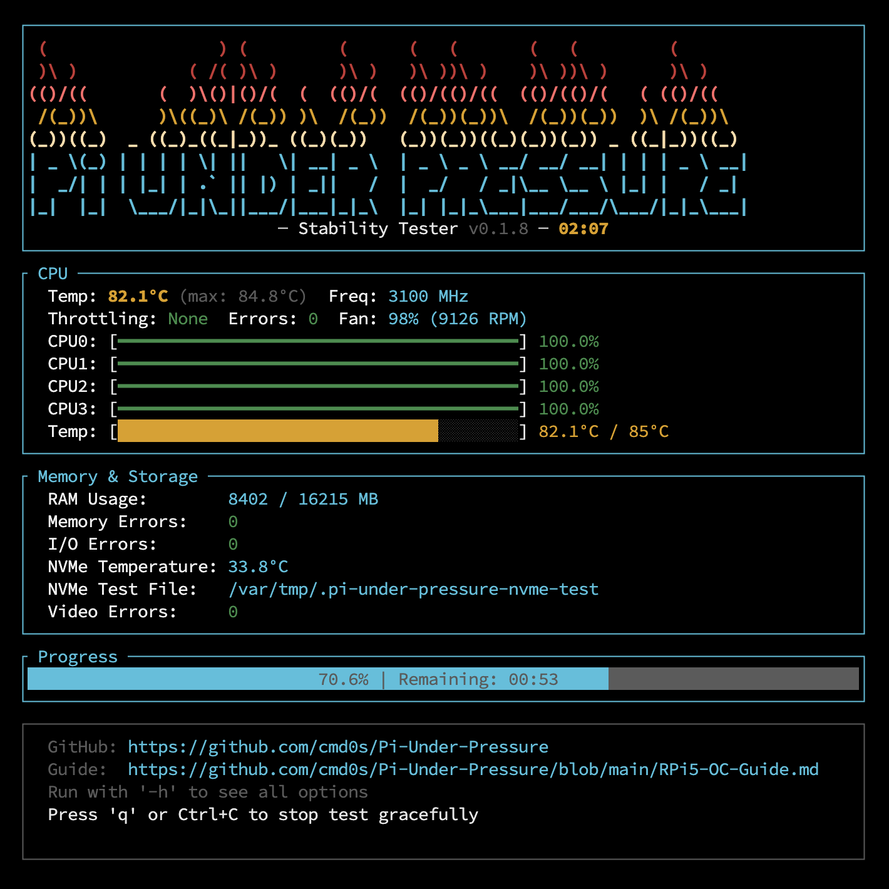
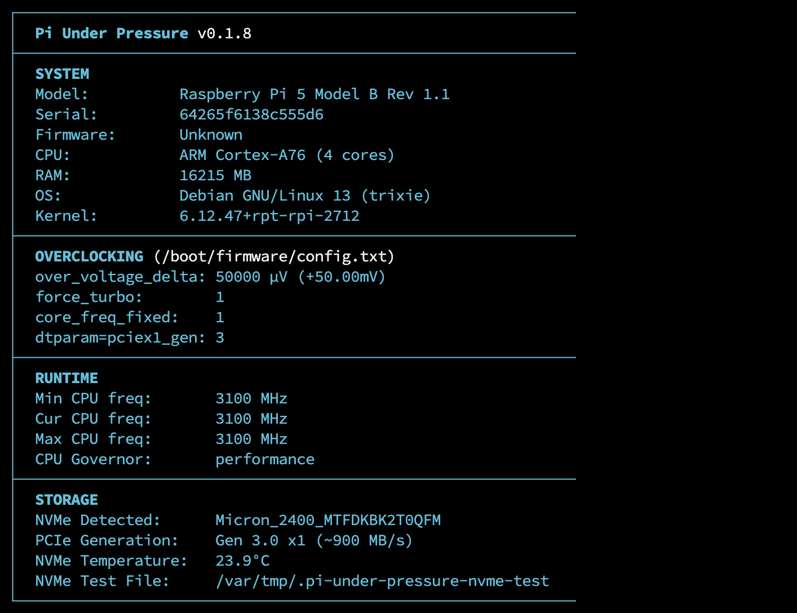
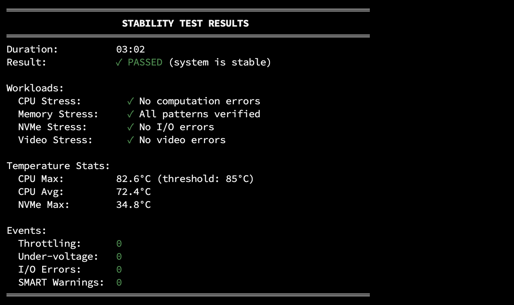

# Pi Under Pressure

**Stability tester for overclocked Raspberry Pi 5**

Pi Under Pressure is a comprehensive stress testing tool designed specifically for Raspberry Pi 5 after overclocking. It tests CPU, RAM, and NVMe stability simultaneously while monitoring temperature, throttling, and system errors.

## Screenshoot



## Features

- **CPU Stress Testing**: DFT, matrix multiplication, prime sieve, and AES-256 workloads
- **Memory Stress Testing**: Random access, sequential patterns, and STREAM-like bandwidth tests
- **NVMe Stress Testing**: 4K random I/O and sequential bandwidth tests (auto-detected)
- **Video Encoder Stress**: Optional hardware H.264 encoder stress via V4L2 (`-V`, requires `ffmpeg`)
- **Real-time Monitoring**: Temperature, frequency, throttling status, and errors
- **Fancy TUI**: Interactive terminal UI with progress bars and gauges
- **Error Detection**: Monitors dmesg/journalctl for I/O errors and kernel issues
- **Comprehensive Reports**: Final stability report with pass/fail status

## Installation

### One-liner Install

```bash
curl -sSL https://raw.githubusercontent.com/cmd0s/Pi-Under-Pressure/main/install.sh | bash
```

### Manual Download

Download the latest binary from [Releases](https://github.com/cmd0s/Pi-Under-Pressure/releases):

```bash
# Download
wget https://github.com/cmd0s/Pi-Under-Pressure/releases/latest/download/pi-under-pressure-linux-arm64

# Make executable
chmod +x pi-under-pressure-linux-arm64

# Move to PATH
sudo mv pi-under-pressure-linux-arm64 /usr/local/bin/pi-under-pressure
```

### Build from Source

```bash
# Install Rust
curl --proto '=https' --tlsv1.2 -sSf https://sh.rustup.rs | sh

# Install required packages
sudo apt install -y build-essential pkg-config

# Clone and build
git clone https://github.com/cmd0s/Pi-Under-Pressure.git
cd Pi-Under-Pressure
cargo build --release

# Binary is at target/release/pi-under-pressure
```

## Usage

### Basic Usage

```bash
# Run 30-minute stability test
pi-under-pressure -d 30m

# Run 1-hour test
pi-under-pressure --duration 1h

# Run 1-hour test with NVMe stress
pi-under-pressure -d 1h -e

# Run 2-hour test with video encoder stress (requires ffmpeg)
pi-under-pressure --duration 2h -V
```

### Options

```
OPTIONS:
    -d, --duration <TIME>     Test duration (e.g., 30m, 1h, 2h30m) [default: 30m]
    -e, --extended            Force extended mode (include NVMe stress)
    -V, --video               Enable hardware video encoder stress (requires ffmpeg)
    -c, --cpu-only            Test only CPU (skip RAM and NVMe)
    -m, --memory-only         Test only RAM
    -n, --nvme-only           Test only NVMe
    -p, --nvme-path <PATH>    Custom path for NVMe stress test file
    -t, --threads <N>         Number of CPU threads [default: all cores]
    -i, --interval <SEC>      Status update interval [default: 2]
    -s, --simple              Use simple output instead of TUI
    -N, --no-color            Disable colors
    -j, --json                Output final report in JSON format
    -h, --help                Print help
    -v, --version             Print version

CONTROLS:
    Ctrl+C or 'q'             Stop test gracefully
```

## System Information Display

On startup, Pi Under Pressure displays comprehensive system information:



## Stability Test Report



## Requirements

- Raspberry Pi 5 (other models may work but are not officially supported)
- Raspberry Pi OS, Ubuntu, DietPi, Armbian or compatible Linux distribution

### Pre-installed Dependencies

These tools are typically pre-installed on Raspberry Pi OS:

- `vcgencmd` - temperature/throttling monitoring (from `libraspberrypi-bin`)
- `dmesg`, `journalctl` - kernel log monitoring
- `lspci` - PCIe device detection

### Optional Dependencies

Install these for additional functionality:

```bash
# Video encoder stress testing (--video flag)
sudo apt install ffmpeg

# NVMe SMART data and detailed info
sudo apt install smartmontools nvme-cli
```

| Package | Provides | Used for |
|---------|----------|----------|
| `ffmpeg` | `ffmpeg` | Video encoder stress (`--video` flag) |
| `smartmontools` | `smartctl` | NVMe SMART data (temperature, wear) |
| `nvme-cli` | `nvme` | Detailed NVMe device info |

## License

MIT License - see [LICENSE](LICENSE) for details.

## Contributing

Contributions are welcome! Please feel free to submit issues and pull requests.

## Acknowledgments

- Raspberry Pi Foundation for the excellent hardware
- The Rust community for amazing tools and libraries
- stress-ng and fio for inspiration on stress testing approaches

## Disclaimer

Raspberry Pi is a trademark of Raspberry Pi Ltd. This software and its author are not affiliated with, endorsed by, or connected to Raspberry Pi Ltd in any way. The use of this trademark is solely for descriptive purposes.
